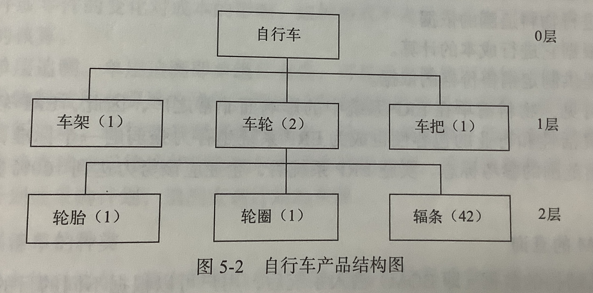
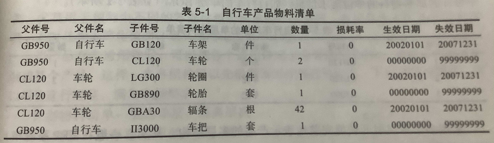
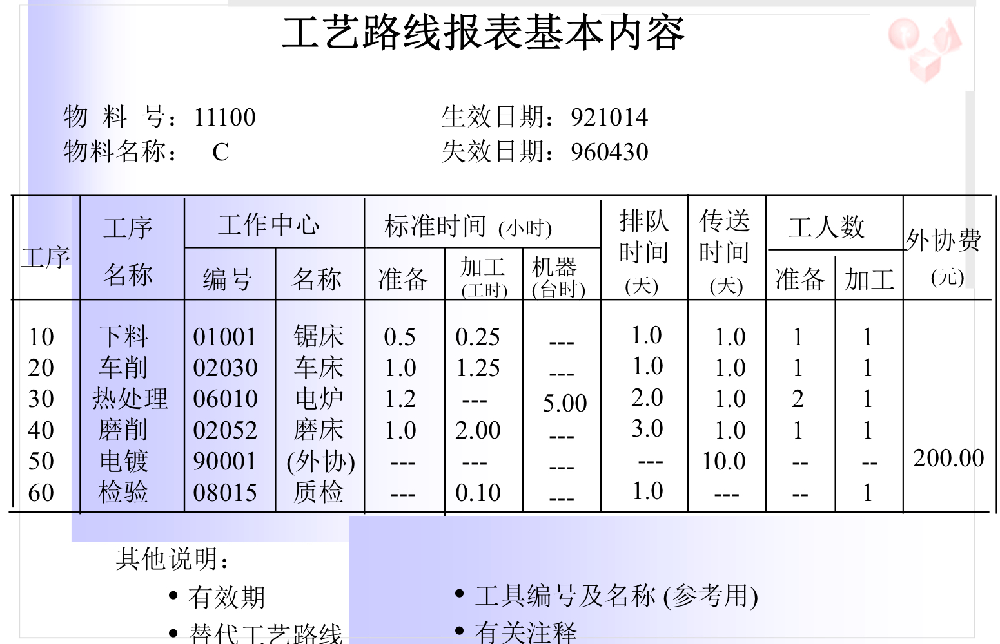
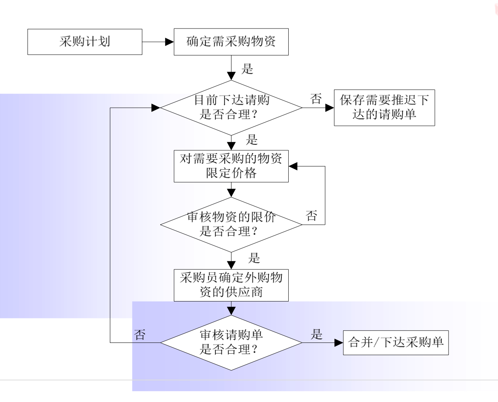
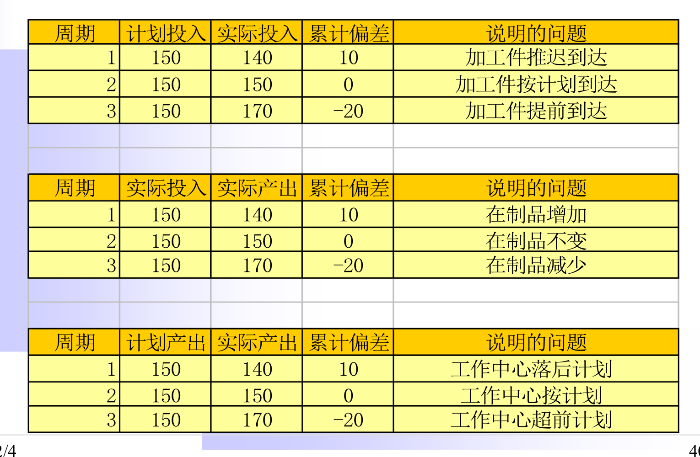
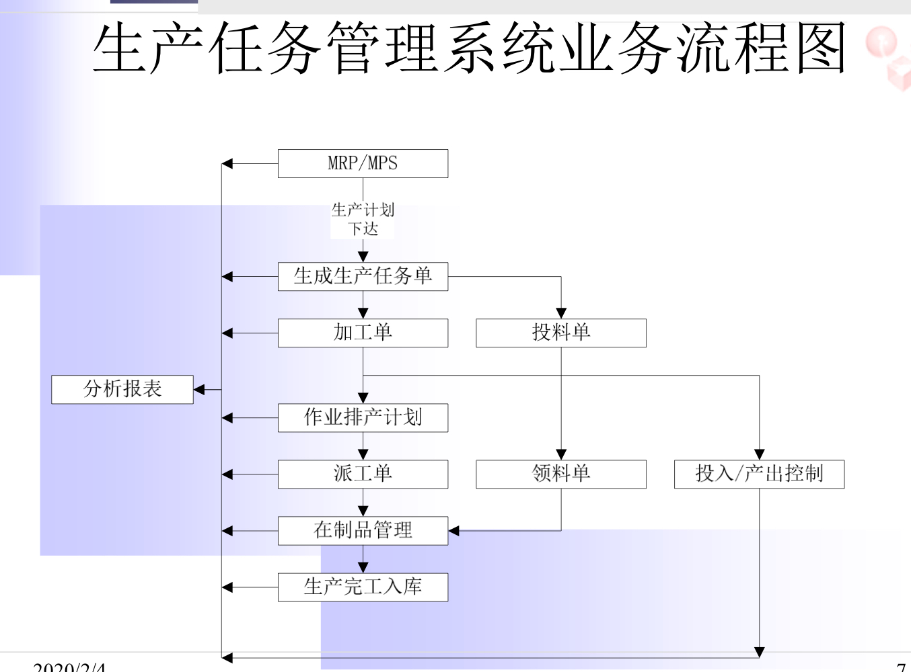
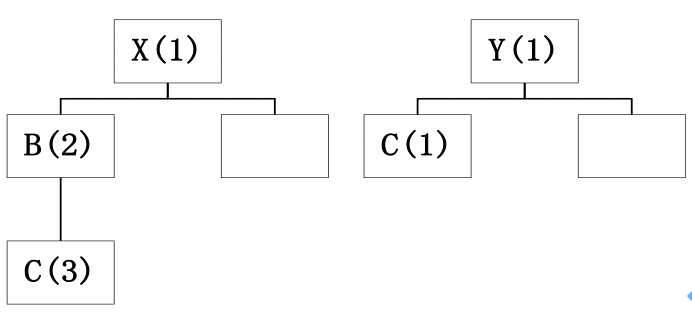
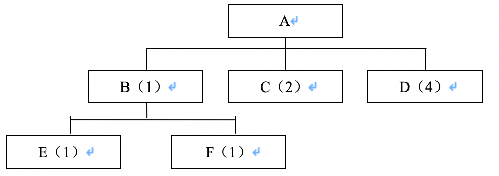
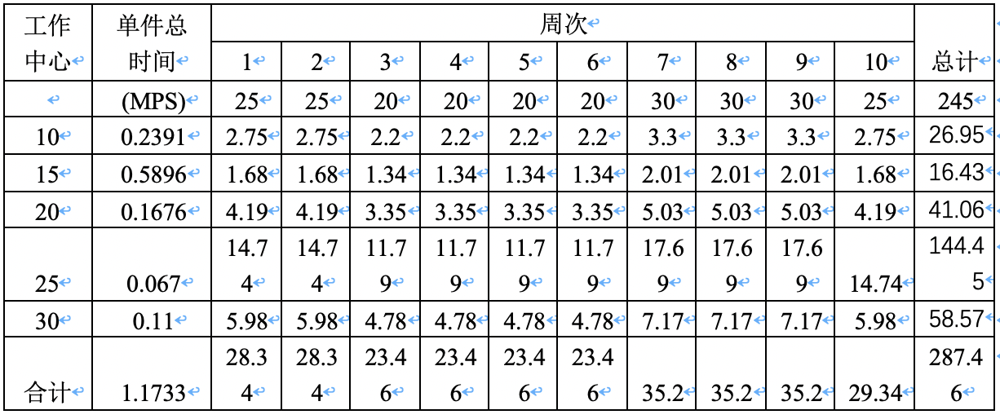

# ERP 精细整理复习

<h5 align="right">version 1.0 by Harry Yao</h5>
<h5 align="right">2021.6</h5>

## 1 考试说明

判断题 10
单选10
多选20
简答30
计算30

**考试范围**： 第1章~第12章
**逻辑脉络**：第一部分，第1、2章，讲解ERP应用背景、概念、国内外ERP产品；第二部分，第3~12章，介绍ERP系统中的主要功能管理模块，包括需求与销售管理、生产规划、主生产计划、物料需求计划、能力需求计划、采购管理、库存管理、车间管理、财务管理、成本管理。注意各业务模块的业务处理和信息化实现原理，分析相互间的关系。

## 2 章节重点研习

### 2.1 第一部分

1. 三流的集成：物流、资金流、信息流。

2. **生产类型**：生产类型是以**生产专业化特征**为标志划分的生产种类，划分的目的是从众多企业中找出生产组织的共同特点。

   1) 从生产工艺角度：企业分为离散型（产品结构上是可才分得，eg:生产要配套的例子）、 连续型(工艺过程是不可停顿的，eg：产品生产流程不可分割，药品) 、混合型生产。

   2) 从生产组织方式（注意优缺点）（会考前三个）：面向订单生产(MTO) 、面向库存生产(MTS) 、面向订单装配(ATO) 、面向订单设计 (ETO)

|                   | 优点                                                         | 缺点                                                         | 实例                       |
| ----------------- | ------------------------------------------------------------ | ------------------------------------------------------------ | -------------------------- |
| MTS(面向库存生产) | 大众化产品，客户可直接从零售、分销商购买产品；交货期短；     | 预测准确性低，订单不稳定；交货期有明显的季节性，生产弹性大；材料、成品存货及车间库存偏大 | 啤酒、日用消费品行业       |
| ATO(面向订单装配) | 客户相对少而稳定，预测准确性高；总装作业计划较为可控；       | 总装作业计划变化非常频繁，配件作业计划和加工计划难度大；     | 计算机、变压器等家电、家具 |
| MTO(面向订单生产) | 客户相对少，预测准确性高，订单相对稳定；材料和成品存货及车间库存合理 | 交货期长，交货压力大，生产弹性完全由订单决定                 | 包装机等大型机械设备企业   |
| ETO(面向订单设计) | 库存基本没有积压；                                           | 交货期长，成本控制难度大；库存报废率较高；BOM不固定，版本更新迅速；采购周期长短均有，制造周期较长； | 造船、锅炉、电梯等大型设备 |

PS：上述生产组织方式，从上到下，提前期依次增长。

3. ERP需要理解：事前-计划， 事中- 控制，事后-反馈评估

4. ERP的基本概念：是对**三流**全面集成管理的信息系统，建立在**信息技术**基础上，利用现代企业先进管理思想，全面集成企业所有资源信息，为企业提供决策、计划、控制、评估的全方位系统化管理平台。

5. ERP的内涵：E-企业是主体，从企业整体利益出发；R-资源（人、财、物、时间），资源的价值体现是资金，物流是基础（物流是企业作重要的价值链和增值过程），信息反映资源的运动变化；P-计划是ERP理念中最核心的部分，依据资源变化规律、市场需求、自身经营进行计划。

6. ERP的发展阶段：

   (1) 订货点法    

   (2) 时段MRP (Material Requirements Planning)

   ​		a. 提出独立需求、相关需求(非独立需求) 

   ​		b. 时间分割(库存状态中时间分段，时间单位、粒度不一样) 

   ​		c. BOM(考虑物料的关系 )

   ​		主要目标是确定物料在每个时区的需求量，是一个开环的计划；

   ​		没有考虑生产企业**现有生产能力**和**采购有关条件**的约束

   ​		计划对象：加入物料订货时间

   ​		应用理论：库存管理、主生产计划、优先级计划、BOM、期量标准

   (3) 闭环MRP 

   ​		a. 封装了四个计划 - 生产能力需求计划、物料需求计划、采购计划、车间作业计划

   ​		b. 高速大存储现代计算机，使得物料能够按周甚至天分解

   ​		c. 事前计划、事中实施、事后评价反馈的封闭循环过程

   ​		计划对象：加入设备、人员的产能

   ​		应用理论：能力需求平衡、生产和采购实行PDCA循环

    (4) MRP II(把财务加进去)  (Manufacturing Resource Planning)

   ​		a. 实现资金流和物流的统一

   ​		b. 计划的一贯性与可行性、管理系统性、数据共享性、动态应变性、模拟预见性

   ​		计划对象：加入营销、财务

   ​		应用理论：系统集成技术、管理会计、物资管理、决策模型

    (5) ERP（继续延展）

   ​		a. 与MRP的区别：**资源管理范围** - 供应链；生产方式管理 - 混合模式；**管理功能**方面 - 内外物流；**事务处理控制**方面 - 除了事前计划、事中控制、事后反馈的优化还有关键问题的实时分析；跨国、跨地区经营的差别；计算机信息处理技术的差别 - C/S、B/S

   ​		计划对象：将客户需求、供应商制造资源作为企业内部制造活动的计划对象

   ​		应用理论：供应链管理、约束理论、业务流程充足、精益生产

7. 相关需求和时间分割的概念是计划的基础，发展的分水岭。是否具有"相关需求"和"时间分割"是判别一套软件是不是生产管理软件的标准。

8. 能力平衡是判定计划是否可行的试金石。是否具有"能力平衡"是判别一套企业管理软件是否实用的试金石。
9. ERP的三大制胜绝技是相关需求、时间分割、能力平衡，
10. ERP的5个计划层次：I. 企业经营规划(企业战略规划)【宏观】【主计划】II. 生产规划(PP, production plan)【宏观】【主计划】 III. 主生产计划 IV. 物料需求计划 V. 车间作业及采购作业

### 2.2 第二部分

#### 2.2.1 需求管理(3)

1. 物料编码：物料的唯一识别代码；
   ps:什么情况下会对同一种物料有相同原料编码？(1)各部门各自用自己的系统(2)供应商不一样
2. 时间定义：时段是描述计划的时间粒度单位
   ps: lay time(提前期)  - 某一工作从工作开始到工作结束的时间周期，注意！不是从工作准备开始到工作准备好！例：生产加工提前期 - 生产加工投入开始至生产完工入库的全部时间。
   pps：计划展望期 - 生产计划所覆盖的时间范围，计划展望期应该大于产品总提前期
3. 预测
   - 为什么要预测？对历史和现在的销售数据进行分析，结合市场调查统计结果，对未来市场情况及发展趋势做出推测，知道今后的销售活动和企业生产活动。
   - 预测和订单的关系？预测可以看做是企业内部的订单，有助于各项业务的决策，预测与实际越接近对销售订单的把握就越准确，越有助于企业做好决策；订单的成本、毛利、利润率、交货期、生产期、资金的回笼情况、企业销售总趋势和盈利趋势，还有各产品、地区、业务员、客户的销售趋势，可以作为预测的数据来源。
   - 预测的条件？产品应该是标准的、通用的
   - 预测的分类？时间【长期(5年或更早)、中期(1~2年)、短期(3~6个月)、近期(每周或每日)】、方式【定性预测(调查、德尔菲、历史类比、经验估计)、定量预测(时间序列、因果回归)】
   - 指数平滑： $预测销量_{n+1} = \alpha \times 实际销量_{n} + (1 - \alpha) \times 预测销量_{n}$

4. 销售管理
   - 使企业能够及时将需求传递到整个生态系统中
   - 销售管理子模块是企业信息流的源头，是企业物流的最后一步
   - 基本内容：销售计划、产品定价、销售报价、销售订单、收发货、销售服务、销售基础数据维护
   - 销售渠道有哪些？直销、分销、零售、线上、线下
   - **【重点】**信用管理
     - 为什么有信用管理？因为有应收账，并且客户的信用是在变化的
     - 信用管理的作用？短期意义：监控、规避风险；长期意义：提升客户质量
     - 概念：信用标准 - 对客户信用要求的最低标准，以预期的DSO(days sales outstanding, 销售变现天数)和坏账损失率为判别标准； 信用额度；信用条件 - 要求支付贷款的条件，包括信用期限、现金折扣；5/20,n/60 - 20天内付清有5%折扣，必须在60天内付清且无折扣
   - 长期、中期、短期计划有何区别与联系？
     - 长期计划根据市场调查和需求分析、国家有关政策、企业资源丽都和历史状况、同行竞争对手的情况等信息，指定企业经营计划，是企业长期发展的愿景。
     - 中期计划根据经营规划的目标，确定企业的每一类产品未来1~3年每年每月生产多少，需要多少资源
     - 短期计划根据企业应生产的最终产品的数量和交货期，在生产需求和可用资源之间做平衡

#### 2.2.2 生产规划(4)

1. 内容：根据未来一段时间预计资源可用量、市场需求量之间的平衡制定的概括性设想。根据生产能力和需求预测，对未来较长时间的产品、产出量做的概括性描述。【中期计划】
   PS：每类产品未来一段时间制造多少？需要何种资源和多少数量？采取哪些措施协调总生产需求和可用资源的差距？
2. 作用：把经营规划中用货币表达的目标转化为产品产量的表达；制定均衡的月产率，均衡地利用资源；控制拖欠量(MTO)或库存量(MTS)；作为编制主生产计划的依据。
3. 生产规划计算题见3.1
4. 生产规划方法：(了解，不考求解) ：平均法(MTO)、滚动计划发(MTS)、线性规划模型、图表法
5. 资源需求计划：确定了各产品的生产规划后还需分析资源是否满足要求；方法：资源清单法、能力需求计划系数法

#### 2.2.3 主生产计划(MPS)(5)

1. BOM： 以数据格式描述产品结构，体现物料数量关系，体现生产过程；树状图要会画，并且注意BOM树状图与双排法的一一对应关系。
   
   

2. BOM需要与各计划联系，分析它的作用  ——生成计划  发料    ；  设置  与工艺路线联系起来 ； 

3. 虚拟件：为了简化对物料清单的管理，在产品结构中虚构一个物品，虚拟件不存在提前期，作为一般性管理使用。

4. 时区与时界：判定环境与需求发生变化的时候，系统能否跟着改变；计算毛需求会用到时区时界的概念(见3.2)

   - 主生产计划有两个时界点：需求时界(DTF, Demand Time Fence)和计划时界(Planned Time Fence, PTF)。需求时界一般与总装提前期一致，可稍大于总装提前期，以提醒遭遇这个时界的订单已经在最后总装。计划时界一般与累计提前期一致，略大于累计提前期，提醒在这个时界与需求时界之间的某些采购计划或生产计划已经开始执行，资金资源已经开始消耗。

   - 计划展望期被划分为三个时间区间：

     - 需求时区：编制计划的当前时刻 ~ 需求时界
     - 计划时区：需求时界 ~ 计划时界
     - 预测时区：计划时界 ~ 计划展望器结束

     上述时区由下到上，为距离当前时刻由近到远

5. MPS计算方法  累计可供销售量ATP、计划接收量等概念，见计算题3.2

6. 指定主生产计划需要哪些信息？来源于哪里？

   - 销售部门：预测、客户订单
   - 技术部门：BOM
   - 生产部门：生产订单
   - 物流部门：库存量

#### 2.2.4 物料需求计划(MRP)(6)

1. MRP计算方法 ：毛需求、期初预计可用库存量 (**PAB初值**) 、净需求量、计划产出量等，见计算题3.3
2. MRP II的4个计划层次：销售规划、产品规划与资源需求计划、主生产计划与粗能力计划、物料需求与能力需求计划，1个执行层次：车间作业与采购作业

#### 2.2.5 能力需求计划(7)

1. 注意粗能力计划:是与主生产计划相伴运行的能力计划，仅对主生产计划所需关键生产能力粗略计算。
2. 方法： 资源清单法
   - 优点：资源清单的简历和存储比较简单；易于维护、计算量小
   - 缺点：库存数据、时间周期等没有考虑到（没有考虑相关需求的在制品或综合库存；没有考虑提前期，在短计划周期、长制造提前期的情况下，方法不够精确）
   - 改进：分时间周期的资源清单法 - 解决提前期的问题  （优点：考虑了提前期，短周期、长提前期的情况下比较精确；缺点：建立存储比较复杂；维护困难、计算量大）
3. 工作中心：是企业直接的生产加工单元，是一组机器设备、人等生产资源的总称。（关键工作中心（瓶颈工序）- 经常满负荷工作或工作不能替代的工作中心）
4. 工作中心的数据：
   - 基本数据：代码、名称、所属部门代码
   - 能力数据：工作中心所属设备数（人数）、每班工时、班次、利用率、效率、关键工作中心
   - 成本数据：费率、机器和人工
5. 注意能力的计算：
   - $工作中心能力 = 每日班次 \times 每班工作时数 \times 效率 \times 利用率$；
   - $效率=\frac{完成的标准定额小时数}{实际直接工作小时数}$ or $效率=\frac{完成的标准定额产量}{实际完成的产量}$  ：原定某工作多少小时做完，实际花了多长时间
   - $利用率=\frac{实际直接工作小时数}{计划工作小时数} $ ：原定计划某段时间要工作多少多长时间，实际上工作了多长时间
6. 加工提前期的五种时间类型：(1)排队时间[非增值] (2)准备时间[增值] (3)加工时间[增值] (4)等待时间[非增值] (5)传送时间[非增值]
   ps：准备时间也是增值作业
   pps: 提前期是计划的基础
7. 影响各类提前期的时间因素

| 时间类型 | 影响因素                       |
| -------- | ------------------------------ |
| 排队时间 | 批量改、优先级、能力、拖欠量   |
| 准备时间 | 批量、工装设计                 |
| 加工时间 | 批量、工装设计、设备性能与能力 |
| 等待时间 | 批量、搬运手段                 |
| 传送时间 | 批量、搬运手段、车间布置       |

7. 工艺路线的表格

   

3. 能力需求计划(CRP)（计算不考，概念要知道）
   - 在CRP之前没有考虑能力
   - CRP是对各生产阶段、工作中心所需资源精确计算，得出各资源负荷情况并做好生产能力和生产负荷的平衡工作，制定出能力需求计划。
4. 无限能力计划是排出来的，有限能力计划是算出来的
   - 无限能力计划
     - 计划时不考虑生产能力的限制
     - 对各个工作中心的能力、负荷进行计算得出工作中心的负荷情况
     - 符合>能力时，对超负荷工作中心进行负荷调整
     - 调整手段：延长工作时间，转移WC符合，选择替代工序，外协加工，延期交货
   - 有限能力计划
     - 认为工作中心能力不变（模型考虑能力约束）
     - 计划按优先级安排，把能力给优先级高的物料，工作中心负荷满的时候推迟低优先物料的加工
     - 得到的计划可以不调整(产生拖期)
5. 制定MRP需要那些信息？数据来源哪里？
   - 计划部门 - MPS结果
   - 技术部门 - BOM
   - 仓储部门 - 库存量
   - 采购部门 - 采购订单
   - 生产部门 - 生产订单

#### 2.2.6 采购管理(8)

1. 订单策略 业务处理
2. 采购模式
   - JIT采购模式(Just In Time)
     - 优点:大幅度减少原材料、外购件库存；提高采购物料质量；降低原料、外购件采购价格
     - 拉式(Pull)的管理模式，要多少给多少
     - 案例：丰田实现0库存
   - MRP采购
     - 特点：需求相关性、稳定性；计划的精细性、复杂性
     - 推式(Push)的计划
   - 供应链采购
     - 指供应链内部企业之间的采购
     - 是供应商主动型采购，是基于需求的采购

3. 采购管理点：供应商管理

   流程：采购计划 -> 跟踪 -> 收货 -> 事后评估

   主要考虑：低成本 快速 合格的物料

   

4. 采购批量策略：不同的成本

- 固定订货批量法

- 经济订货批量法(EOQ)

  - $EOQ = \sqrt{\frac{2RS}{IC}}$; R:年需求量 S:每次订货成本 I:商品保管费用比例 C:商品单价   (非重点)

- 按需订货批量法(Lot For Lot)   -  常用于价值较高和需求不连续的外购件及制造件

- 固定周期法(Fixed Period Requirements) - 常用于海外采购、海运

- 批量增量法(Batch Increment)  -  设置固定批量和批量增量

  订购批量策略影响的例子（见3.7）

5. 委外加工
   -  半成品委外
   - 工序委外（B->A中间的一道工序）  
6. 采购管理与财务管理之间传递那些数据？
   - 财务采购订单信息、采购到货信息、采购发票、财务进行付款
7. 采购管理的信息来自哪里？采购员做哪些日常工作？
   - 来自MRP采购计划，也有库存信息(补库)，生产中对原料的需求信息
   - 采购员主要负责：采购计划管理、供应商评估管理、采购计划执行、某些物品的请购、下发给供应商采购订单、跟催、付款等。

#### 2.2.7 库存管理(9)

1. 库存管理的三个层面？举例说明。

   (1)战略层面——库存管理模式。 库存管理模式主要可以分为传统的库存管理模式、供应商库存管理模式、联合库存管理模式和协同式供应链库存管理模式。他们都是在战略层面上与战略贸易伙伴之间的合作性策略。

    (2)战术层面——库存管理策略。为了提高库存管理水平和服务水平，对库存量的控制建立在合理的库存控制策略上。一般ERP具有独立需求库存控制和相关需求库存控制，同时还提供衡量库存管理的评价指标，以供库存管理人员了解库存状况，支持库存管理决策。

   (3)业务层面——日常事务。比如库存的盘点方式的改进，使用循环库存盘点低成本、精细化地进行盘点，还有其他诸如库存管理与财务、采购、成本等日常事务的联系。

2. 库存管理策略
   - 库存分类(见4)与安全库存
   - ABC库存 
     -  帕累托原理: A(0.7~0.8/0.1~0.2) B(0.2/0.2~0.3) C(0.05~0.1/0.6~0.7)
   - 库存盘点
     - 有效控制物料数量，而对各储存场所进行数量清点
     - 目的：确定现存量、计算损益、稽核物料管理的绩效
     - 时机：A类(每周一次) B类(每月一次) C类(半年盘点一次)
     - 分类：账面盘点/期末盘点
     - 分类：期末盘点/循环盘点
     - 为什么会有期末盘点？一方面为了确定现存量、计算损益、稽核物料管理的绩效，另一方面，期末需要出具报告，需要有确定损益以表达财务状况
     - 循环盘点优点：周期性地发现问题并采取措施；完全或部分地消除由于盘点而造成的停产；提高循环盘点人员素质
     - 期末盘点的优点：结果精确全面，不用频繁盘点。
     - ERP在盘点中有什么样的便利？可以帮助进行盘点，打印好盘点表，录入系统，生成差异清单，将账面数量和实物数量保持一致，然后将不一致的部分做账。
   - 库存补充方法：
     - 定量库存控制模型(连续检查)
     - 定期库存控制模型(周期检查)

3. 库存事务 (库存管理的日常事务)

   外购入库业务、生产领料业务、产品入库、生产退料、受托加工、仓库调拨、销售出库、库存盘点、计算机辅助库存管理系统中查询库存帐与报表

4. 库存的分类
   - 按存在状态
     - 原材料库存
     - 成品库存
     - 部件库存
     - 备件库存
     - 在制品库存
   - 按库存用途
     - 经常性库存
     - 安全库存
     - 季节性库存
     - 战略库存 (快速运输，减少战略库存)
     - 在途库存
5. 为什么要有库存？
   - 维持销售产品、生产的稳定
   - 平衡企业物流、流通资金的占用
   - 应对不确定因素

#### 2.2.8 车间管理(10)

1. 生产作业控制(PAC,Production Activity Control) 是**ERP管理思想**(计划层次)中的**执行**层面(计划执行与控制层)
   -  生产计划与进度存才偏差的原因？
   - 控制重点与生产类型的关系: 重复制造(节拍)、离散制造(成套)、流程制造(批量)
   - 要素: 控制标准、信息、措施
   - 生产进度控制(从准备到制成品入库，在时间和数量上对进度控制)
   - 投入产出控制（input/output control-I/O）衡量能力执行情况的方法。
     - 投入产出的控制中ERP能够帮你实时获取投入产出表，有ERP能做到投入产出的实时控制
     - I/O计算主要生成某一时间段内各工作中心的计划投入工时、计划产出工时等其他信息
     - 分析报表的图要理解
   - 现场实时调动、调整
   - 作业信息收集
     - 采集手段: 完全手工 、完全计算机、混合采集
     - 数据对象：人工数据、生产数据、质量控制数据、物料流动数据
     - 采集频率：作业环境变化较大的话应该高频率
     - 数据粒度：工序采集(频率高)、生产状况监测点(频率低)
   - 简述ERP在投入产出控制中的作用
     - 生产进度控制包括投入进度控制和产出进度控制两方面内容
     - 投入/产出控制是衡量执行情况的一种方法。通过ERP生成的投入/产出报告了解生产进展的情况，分析出现的问题，对失控的状况进行纠正，还可以控制计划、排队时间和提前期。
     - ERP系统可以实现工作中心或工序的数据采集，可以实时获取生产进度信息，因此可以随时由系统生成投入产出报告/报表，当生产出现偏差时，可以及时调整生产安排。

2. 加工单和投料单的来源来自于生产任务单；对所有的工作中心排产，生成派工单、投料单；按不同领料方式生成领料单；过程有投入产出的控制
3. 业务流程图
4. 领料方式
   - 全部领料
   - 工序领料：企业根据工序作业计划按照工序领料，
   - 倒冲法领料：针对某些物料，把物料批量移动到车间仓库，生产完工入库时根据入库数量按照BOM单位定额耗用量自动生成领料单和物料耗用量。适用于低值易耗品。

5. 工艺路线的设置里面涉及到的工序、工作中心和前面的bom怎么联系起来？

6. 车间日历
7. 派工单的作用是什么？
   - 当工序排产计划和工序优先级确定后，就需要及时下达派工单，按照车间派工单进行生产作业
   - 派工单是说明该某时段工作中心的加工任务与任务优先级的文件，作用是安排加工任务，使任务执行状态转为开工
   - 派工单是最基本的生产凭证之一，除了有开始作业、发料、搬运、检验等生产指令的作用外，也是对工人从事生产活动的原始记录，还是控制在制品数量、检查生产进度、核算生产成本的凭证。
8. 车间任务单的对象是车间，加工单的对象是物料，派工单的对象是工作中心。

#### 2.2.9 财务管理(11)

1. 财务会计与管理会计的区别，财务对外，管理对内。

|          | 财务会计                                 | 管理会计                                                     |
| -------- | ---------------------------------------- | ------------------------------------------------------------ |
| 性质     | 对外报告，使企业间具有可比性             | 对内报告，一般不公开                                         |
| 使用对象 | 企业外部                                 | 企业内部                                                     |
| 使用目的 | 生成国家规定的财务报表以满足企业决策需要 | 生成详细程度不同、没有特定格式的会计报表，以支持企业特定管理目的 |
| 时间性   | 按照国家规定的时间                       | 按管理需要自定义时段                                         |
| 限制因素 | 受国家法规、会计条例或准则的限制         | 满足企业成本效益分析的要求为准，无强制约束                   |

2. 财务管理的主要作用
   - 财务计划
   - 财务分析
   - 财务决策
3. ERP中财务管理的主要功能包括哪些？
   - 一般的ERP软件的财务管理分为会计核算和财务管理两大块。
   - 会计核算为财务管理服务，反映企业经营过程和经营结果，主要负责原始单据的收集、整理、记录、等级漳浦和编制会计报表等，为企业管理童工综合财务信息，是企业决策支持系统的重要组成部分。
   - 财务管理工作贯穿于企业生产经营活动柜的全过程，通过分析各种会计核算数据，结合其他生产、经营、环境、政策等因素，确定企业的投融资和股利分配决策。
4. 财务管理子系统(分别说明财务管理的主要功能？)
   - 总账管理
     - 提供清晰完整的总账结构，将公司、业务领域和会计科目表有机地集成在一起。
     - 总账管理主要有凭证管理、账簿管理、期末结账等账务处理的基本功能。它是整个会计核算的核心，支撑和统率着其他各部分功能。
   - 应收账管理
     -  信用管理【复习课被cue到】
     - ERP在其中的作用：有ERP的话可以实时管理大量信息，并且可以设置控制点  信用管理的实施短期可以减少坏账，长期可以提高用户质量
     - 进行应收款的核算和客户往来账的管理，有利于数据的汇总、成本的预测。在应收账的账务处理中，往往会产生各种应收票据，如期票、汇票和支票，这些应收票据要有收到和签发处理、到期手绘和偿付处理、贴现处理、票据登记处理，还有坏账处理、客户账龄报告和分析。
   - 应付款管理
   - 工资管理
     - 面向企业人力资源人员，支持多种模式的薪酬核算管理，并实现薪酬发放业务，包括个人所得税申报和银行代发业务；帮助企业承载薪酬体系构建和定薪调薪管理，以及薪酬发放的全过程管理业务，可将工资核算结果数据提供给ERP财务系统统一核算。
   - 固定资产管理
     - 以固定资产卡片管理为基础，帮助企业实现对固定资产的全面管理，包括固定资产的新增、清理、变动，按国家会计准则的要求进行计提折旧，以及折旧相关的基金计提和分配的核算工作。
   - 现金管理
     - 现金管理能处理企业中的日常出纳业务，包括现金业务、银行业务、票据管理及其相关报表、系统维护等内容。同时，会计人员能在该系统中根据出纳录入的首付款信息生成凭证并传递到总账系统。
   - 财务分析与财务报表

5. 折旧方法  了解 见3.5

6. 常识 - 财务报表 四大报表

#### 2.2.10 成本管理(12)

1. 产品成本主要指制造成本(料工费)，具体如下：

   - 产品的制造成本包括直接成本和间接成本。 

   - 直接成本包括直接材料费、直接人工费；间接成本（制造费用）需要分摊到各个产品，包括变动制造费和固定制造费

2. 注意标准成本和实际成本的差异比较

3. 标准成本和实际成本中，人工成本、材料成本、制造费用的数据分别来自于哪里？

   |          | 标准成本                                              | 实际成本                                                     |
   | -------- | ----------------------------------------------------- | ------------------------------------------------------------ |
   | 人工成本 | 人工费率-事先设置，人工时间-工艺路线                  | 实际采集数据，包括工时和金额，反过来计算各工作中心人工费率   |
   | 材料成本 | 数量-BOM，价格-实现设置的计划价                       | 数量-实际领用料，价格-基于采购入库价格的各种计价方式         |
   | 制造费用 | 制造费率-事先设置，加工时间（传统分摊依据）--工艺路线 | 实际采集数据，包括工时和金额，反过来算各工作中心制造费率还可实现各种费用分摊方式 |

   

4. 直接材料费的计算方式：

   - 个别计价
   - 先进先出 
   - 加权平均 
   - 移动加权平均

5. 作业成本法与传统成本法计算 间3.6

6. 传统成本法与标准作业成本法两种成本法的区别？(看一看，不需要背)

   - 成本计算的对象不同。传统成本法以产品为中心，以产品作为成本计算的对象，归集生产费用，计算产品成本；而作业成本法以作业为中心，追踪成本发生的前因后果，形成以作业为核心的成本核算对象体系。

   - 成本计算程序不同。传统成本法按部门归集制造费用，确定该费用分配率，将制造费用分配到产品成本中；作业成本法案作业归集制造费用，以多成本动因确定费用的分配率。

   - 成本核算范围不同。传统成本法的核算范围是产品成本；而作业成本法的核算范围不仅包括产品成本，还包括作业成本。

   - 费用标准不同。传统成本法对于间接制造费用的分配，通常采用人工工时、机器工时等财务变量标准；而作业成本法对于间接制造费用的分配，通常以成本动因作为标准，既可以是财务变量，也可以是非财务变量。

   - 提供的成本信息不同。传统成本法提供的是企业最终产品的成本相关信息，由于间接制造费用的分配采用单一标准，当产品成本中制造费用比重较大的时候，成本信息的可以用价值就相对较差；而作业成本费用的分配采用多成本动因标准，拓宽了成本计算的范围，不但提供产品成本信息，还提供作业成本信息，为成本控制和相关决策提供了有价值的资料。

5. 半成品和成品之间的某些费用   —— 约当产量法

   

## 3 计算题整理(括号中为章节号)

### 3.1 生产计划大纲编制(4)

Comment: 最简单的一类生产计划计算题，将总需求量平均分摊到个月，可能涉及到余数时，优先将余数分摊到最后几个月。根据信息算出期初可用库存(计算式：期初库存 - 拖欠库存​，可能直接给出)，计算总生产需求(预测需求+目标库存-期初可用库存)，然后根据均摊的月生产需求和销售，计算各月库存。

**例：**编制MTS环境下生产计划大纲：某公司生产轿车，年预测量为4200辆，月预测量350辆，当前库存为1750量，拖欠定货数为1050辆，目标库存为350辆，请编制其生产大纲初稿。

**解：**

期初可用库存 = 当前库存 - 拖欠 = 1750 - 1050 = 700
总生产需求 = 预测量 + （目标库存 – 期初可用库存） = 3850 = 320 * 11 + 330

|                             | 1月  | 2月  | 3月  | 4月  | 5月  | 6月  | 7月  | 8月  | 9月  | 10月 | 11月 | 12月 | 全年 |
| --------------------------- | :--- | ---- | ---- | ---- | ---- | ---- | ---- | ---- | ---- | ---- | ---- | ---- | ---- |
| 销售预测                    | 350  | 350  | 350  | 350  | 350  | 350  | 350  | 350  | 350  | 350  | 350  | 350  | 4200 |
| 生产计划大纲                | 320  | 320  | 320  | 320  | 320  | 320  | 320  | 320  | 320  | 320  | 320  | 320  | 3850 |
| 期初库存  700      预计库存 | 670  | 640  | 610  | 580  | 550  | 520  | 490  | 460  | 430  | 400  | 370  | 350  |      |

### 3.2  MPS计划确定(5)

概念说明:

	- MPS : 主生产计划(Master Production Schedule)
	- 时区：见章节重点
	- PAB：预计可用库存量(Projected Available Balance)，到某个时点的预计库存量。$预计可用库存量 = 前一时段末可用库存量 + 本时段计划接收量 + 计划产出量 - 本时段毛需求$
	- ATP：可供销售量、可承诺量(Available to Promise)，指可用于销售的数量。$可供销售量 = 某时段的计划产出量 + 该时段计划接收量 - 下一次出现计划产出量之前各时段合同量之和$

Comment:

1. 题目会给出MPS相关的条件，主要关注期初可用库存、安全库存、提前期、批量、时段或时界（如果给时界的话，两个时界将时间划分为三区，比如需求时界-时段3和计划时界-时段7划分出1~3，4~7，8~最后三个时区）。
2. 题目应该会给出预测量和订单量(实际需求)
3. 根据预测量和实际需求量计算毛需求量：需求时区取实际需求量，计划时区取$max(实际需求量,预测量)$，预测时区取预测量。
4. (如果题目中有**计划接收量**和**期初预计库存量**的话，准备好这两个数字)
5. 如果计算第i时段的PAB（预计可用库存量），首先计算PAB初值$PAB初值_{i} = PAB_{i-1} + 计划接收量_{i} - 毛需求_{i}$。(1) 如果 $PAB初值_{i} >= 安全库存$ 则 净需求量 = 0，$PAB_{i} = PAB初值_{i}$ 。(2) 而如果$PAB初值_{i} < 安全库存$ ，则 $净需求_{i} = 安全库存 - PAB初值_{i}$ ，然后按照固定批量，取一个刚好大于净需求量，并且是固定批量整数倍的值，作为计划产出量。然后可以得到$PAB_{i} = 计划产出量_{i} - 预计库存初值_{i}$。
6. 重复第5步，直到所有的PAB初值、PAB、净需求量和计划产出量都计算好，转下一步。
7. 根据提前期和成品率，计算计划投入量，填写在表格内。
8. 如果有要求计算**可供销售量**，第1个时段和每个有计划产出量的时段都应该填写上可供销售量ATP。假如计算时段i的可供销售量，j是时段i下一个有计划产出量的时段，$ATP = 计划产出量_{i} - \sum_{k=i}^{j-1}{订单量_{k}}$。初步计算好所有ATP后可能有负数，于是开始从后向前调整，将所有负数向前挪，用前面的正数去抵消后面的负数。对于第1个时段，$ATP_{1} = 期初库存 + 计划接收量_{1} + 计划产出量_{1} - 订单量_{1}$。

例：试完成一个MPS的初步计划的确定：预计MPS的数量和预计库存量。已知该项目的期初库存为160，安全库存为20，MPS批量为200，实际需求见表中所示，生产提前期是1，需求时界为4，计划时界为8。

| 时区          | 需求时区 |      |      |      | 计划时区 |      |      |      | 预测时区 |      |      |      |
| ------------- | -------- | ---- | ---- | ---- | -------- | ---- | ---- | ---- | -------- | ---- | ---- | ---- |
| 时段          | 1        | 2    | 3    | 4    | 5        | 6    | 7    | 8    | 9        | 10   | 11   | 12   |
| 预测量        | 90       | 58   | 80   | 85   | 80       | 80   | 80   | 80   | 80       | 80   | 80   | 80   |
| 实际需求      | 72       | 100  | 92   | 40   | 64       | 112  | 0    | 8    | 0        | 60   | 0    | 0    |
| 毛需求        | 72       | 100  | 92   | 40   | 80       | 112  | 80   | 80   | 80       | 80   | 80   | 80   |
| PAB初值       | 88       | -12  | 96   | 56   | -24      | 64   | -16  | 104  | 24       | -56  | 64   | -16  |
| 预计库存量PAB | 88       | 188  | 96   | 56   | 176      | 64   | 184  | 104  | 24       | 144  | 64   | 184  |
| 净需求        |          | 32   |      |      | 44       |      | 36   |      |          | 76   |      | 36   |
| MPS计划产出量 |          | 200  |      |      | 200      |      | 200  |      |          | 200  |      | 200  |
| 计划投入      | 200      |      |      | 200  |          | 200  |      |      | 200      |      | 200  |      |

可供销售量ATP的计算示例见教材p95(7)

### 3.3  MPS + MRP的计算 (6)

Comment: MPS与MRP计算相结合的题目，相比于纯粹MPS计算思路要简单，但是可能计算相对更多一些。核心是根据BOM寻找物料需求的数量关系。根据BOM的数量关系，将各个毛需求算出来，之后的预计库存量、净需求、计划产出、计划投入等数值的计算都与上面MPS的计算类似。

例：请计算MPS和MRP

产品X和Y的毛需求如下表

|         | 4    | 5    | 6    | 7    | 8    | 9    | 10   | 11   |
| ------- | ---- | ---- | ---- | ---- | ---- | ---- | ---- | ---- |
| X毛需求 |      |      |      | 40   | 80   |      | 105  | 70   |
| Y毛需求 |      |      |      |      | 30   | 80   |      | 180  |

各个物料的基础数据如下：

| 物料 | 提前期 | 安全库存 | 期初库存 | 订单批量 |
| ---- | ------ | -------- | -------- | -------- |
| X    | 1      | 15       | 40       | 50       |
| Y    | 1      | 0        | 50       | 1        |
| B    | 1      | 10       | 40       | 1        |
| C    | 2      | 20       | 60       | 10       |

BOM结构如下：

解：

计算X的MPS

| 时段             | 4    | 5    | 6    | 7    | 8    | 9    | 10   | 11   |
| ---------------- | ---- | ---- | ---- | ---- | ---- | ---- | ---- | ---- |
| 毛需求           |      |      |      | 40   | 80   |      | 105  | 70   |
| 计划接收量       |      |      |      |      |      |      |      |      |
| 预计库存量（前） | 40   | 40   | 40   | 0    | -30  | 20   | -85  | -55  |
| 预计库存量（后） | 40   | 40   | 40   | 50   | 20   | 20   | 15   | 45   |
| 净需求           |      |      |      | 15   | 45   |      | 100  | 70   |
| 计划产出         |      |      |      | 50   | 50   |      | 100  | 100  |
| 计划投入         |      |      | 50   | 50   |      | 100  | 100  |      |

计算Y的MPS

| 时段             | 4    | 5    | 6    | 7    | 8    | 9    | 10   | 11   |
| ---------------- | ---- | ---- | ---- | ---- | ---- | ---- | ---- | ---- |
| 毛需求           |      |      |      |      | 30   | 80   |      | 180  |
| 计划接收量       |      |      |      |      |      |      |      |      |
| 预计库存量（前） | 50   | 50   | 50   | 50   | 20   | -60  | 0    | -180 |
| 预计库存量（后） | 50   | 50   | 50   | 50   | 20   | 0    | 0    | 0    |
| 净需求           |      |      |      |      |      | 60   |      | 180  |
| 计划产出         |      |      |      |      |      | 60   |      | 180  |
| 计划投入         |      |      |      |      | 60   |      | 180  |      |

计算B的MRP

| 时段             | 4    | 5    | 6    | 7    | 8    | 9    | 10   | 11   |
| ---------------- | ---- | ---- | ---- | ---- | ---- | ---- | ---- | ---- |
| 毛需求           |      |      | 100  | 100  |      | 200  | 200  |      |
| 计划接收量       |      |      |      |      |      |      |      |      |
| 预计库存量（前） |      |      | -60  | -90  |      | -190 | -190 |      |
| 预计库存量（后） | 40   | 40   | 10   | 10   | 10   | 10   | 10   | 10   |
| 净需求           |      |      | 70   | 100  |      | 200  | 200  |      |
| 计划产出         |      |      | 70   | 100  |      | 200  | 200  |      |
| 计划投入         |      | 70   | 100  |      | 200  | 200  |      |      |

计算C的MRP

| 时段             | 3    | 4    | 5    | 6    | 7    | 8    | 9    | 10   | 11   |
| ---------------- | ---- | ---- | ---- | ---- | ---- | ---- | ---- | ---- | ---- |
| 毛需求           |      |      | 210  | 300  |      | 660  | 600  | 180  |      |
| 计划接收量       |      |      |      |      |      |      |      |      |      |
| 预计库存量（前） |      |      | -150 | -280 |      | -640 | -580 | -160 |      |
| 预计库存量（后） | 60   | 60   | 20   | 20   | 20   | 20   | 20   | 20   | 20   |
| 净需求           |      |      | 170  | 300  |      | 660  | 600  | 180  |      |
| 计划产出         |      |      | 170  | 300  |      | 660  | 600  | 180  |      |
| 计划投入         | 170  | 300  |      | 660  | 600  | 180  |      |      |      |

### 3.4 粗能力计划编制(7)

粗能力计划资源清单法复杂例题见教材p127

Comment: 题目一般会给出产品BOM（计算分摊到工作中心的单件加工时间的时候，需要考虑BOM中的数量关系），主生产计划（最后计算每个计划周期各个工作中心的能力需求计划时用到），某产品的工艺路线文件（用以计算各零件的单件准备时间和汇总各工作中心的单件总时间）

	1. 在工艺路线文件中，如果单件准备时间和单件总时间没有，计算$单件准备时间 = \frac{生产准备时间}{平均批量}$，$单件总时间 = 单件准备时间 + 单件加工时间$
	2. 产品A的能力清单中，对工作中心t，有k个零件在中心t生产，每个零件根据BOM推算出来每生产1件A需要i零件$N_{i}$个，于是有$工作中心单件总时间_{t} = \sum_{i=1}^{k} (N_i \times 零件单件总时间_{i})$。由此可以直接计算出各个工作中心的单件总时间，将这个算出来的各个工作中心的总时间与每周产品A的生产计划数量相乘，得到产品A的能力需求计划。（如果题目中在产品A的能力清单中，除了工作中心对应的单件总时间外，还要求单件加工时间和单件生产准备时间，可以按照与上面总时间同样的逻辑，用工艺路线中的单件加工时间和单件准备时间进行计算）

例：某产品A对应的生生产计划（MPS）、工艺路线及工时定额信息和物料清单分别如表所示，关键工作中心15的额定能力一周为36工时，试编制其粗能力计划，并进行关键工作中心15能力分析。

| 计划周期   | 1    | 2    | 3    | 4    | 5    | 6    | 7    | 8    | 9    | 10   |
| ---------- | ---- | ---- | ---- | ---- | ---- | ---- | ---- | ---- | ---- | ---- |
| 主生产计划 | 25   | 25   | 20   | 20   | 20   | 20   | 30   | 30   | 30   | 25   |

<h6 align="center">表1</h6>

| 零件  号 | 工序  号 | 工作  中心 | 单件  加工时间 | 生产  准备时间 | 平均  批量 | 单件准  备时间 | 单件  总时间 |
| -------- | -------- | ---------- | -------------- | -------------- | ---------- | -------------- | ------------ |
| A        | 10       | 30         | 0.09           | 0.4            | 20         | 0.02           | 0.11         |
| B        | 10       | 25         | 0.06           | 0.28           | 40         | 0.007          | 0.067        |
| C        | 10       | 15         | 0.14           | 1.6            | 80         | 0.02           | 0.16         |
|          | 20       | 20         | 0.07           | 1.1            | 80         | 0.0138         | 0.0838       |
| E        | 10       | 10         | 0.11           | 0.85           | 100        | 0.0085         | 0.1185       |
|          | 20       | 15         | 0.26           | 0.96           | 100        | 0.0096         | 0.2696       |
| F        | 10       | 10         | 0.11           | 0.85           | 80         | 0.0106         | 0.1206       |

<h6 align="center">表2</h6>

解：

根据题中所示分别计算单件产品A对各工作中心的能力需求。  

| 工作中心 | 单件加工时间 | 单件准备时间 | 单件总时间 |      |
| -------- | ------------ | ------------ | ---------- | ---- |
| 10       | 0.22         | 0.0191       | 0.2391     |      |
| 15       | 0.54         | 0.0496       | 0.5896     |      |
| 20       | 0.14         | 0.0276       | 0.1676     |      |
| 25       | 0.06         | 0.007        | 0.067      |      |
| 30       | 0.09         | 0.02         | 0.110      |      |
| 合计     | 1.05         | 0.1233       | 1.1733     |      |

根据能力清单和主生产计划，计算A的粗能力计划

最后根据工作中心的额定能力及产品A的粗能力需求，工作中心15在各时期的能力需求均小于其额定能力，为正常负荷状态。

### 3.5 折旧计算(11)

comment ：

1. 平均年限法（直线法）：$折旧额 = \frac{资产原值-净残值}{折旧年限} \times 折旧年数$
2. 工作量法：$折旧额 = \frac{资产原值-净残值}{可工作小时数} \times 工作小时数$
3. 双倍余额递减法：$年折旧率 = 2 \times \frac{1}{预计使用年限}$；$年折旧额 = 资产账面净值 \times 年折旧率$；$月折旧额 = \frac{年折旧额}{12}$

4. 年数总和法： $固定资产年折旧率 = \frac{(预计使用年限 – 已使用年限)}{[预计使用年限 \times (预计使用年限 + 1)] \div 2}$;$固定资产年折旧额=资产原值\times(1-净残值率)\times{固定资产年折旧率}\times{\frac{实际使用月数}{12}}$;

PS: 记预计使用年限为n，则$\frac{n\times(n+1)}{2}$实际上是数列{1,2,...,n}求和，则年数总和实际上就是$\frac{目前还可以使用的年限}{\sum各年还可以使用的年限}$;

例：丁企业在2002年3月购入一项固定资产，该资产原值为300万元，采用年数总和法计提折旧，预计使用年限为5年，预计净残值为5%，要求计算出2002年和2003年对该项固定资产计提的折旧额。 

解：

$2002年固定资产年折旧率=\frac{(预计使用年限 – 已使用年限)}{[预计使用年限 \times (预计使用年限 + 1)] \div 2} = \frac{(5 - 0)}{5 \times 6 \div 2} = \frac{1}{3}$

$2002年固定资产年折旧额=300 \times 95\% \times \frac{9}{12} * \frac{1}{3} = 71.25 (万元)$

$2003年固定资产年折旧率=\frac{(预计使用年限 – 已使用年限)}{[预计使用年限 \times (预计使用年限 + 1)] \div 2} = \frac{(5 - 1)}{5 \times 6 \div 2} = \frac{4}{15}$

$2003年固定资产年折旧额=300 \times 95\% \times (\frac{4}{15} \times \frac{9}{12} +  \frac{1}{3} \times \frac{3}{12})= 80.75 (万元)$

Attention: 2003年中，按照年数总和法，有3个月属于2002年的，要按照2002年的折旧率计算，另外9个月按照2003年的折旧率计算。

### 3.6 作业成本法计算(12)

comment: 

传统成本法：

	-  $成本率(分配率) = \frac{作业成本}{总作业量}$ ； $分配作业成本 = 成本率 \times 耗用作业量$；
	-  先将总成本按标准分摊到不同部门，在部门内再按不同产品所需标准量进行分摊。

作业成本法：

	- $成本动因率 = \frac{资源分配或作业成本}{各产品耗用总量}$;
	- 对于各个作业用某产品该动因的耗用量 * 成本动因率，得到分配额，求和后就是按作业分摊的各产品的制造成本
	- 由制造成本求得单位制造成本，加上直接材料成本、直接人工费用等不需分摊的单位成本后，获得的成本为最终单位成本。

例：某公司加工生产两类产品A、B，且同时在一加工车间进行制造，已知这两种产品占用的直接人工工时分别为2.5和2,直接材料费用为36和30，人工费工时费率为7，按工时单位制造费用分配率为18。传统成本会计核算过程如表所示。

|                                | A产品  | B产品   | 说明                       |
| ------------------------------ | ------ | ------- | -------------------------- |
| 直接人工工时（小时） （1）     | 2.5    | 2       |                            |
| 直接人工费用（元） （2）       | 17.5   | 14      | 工时费率为7                |
| 直接材料费用（元） （3）       | 36     | 30      |                            |
| 单位制造费用分配率（元） （4） | 18     | 18      | 按工时                     |
| 单位制造费用（元） （5）       | 45     | 36      | (5)=(1)*(4)                |
| 单位成本（元） （6）           | 98.5   | 80      | (6)=(2)+(3)+(5)            |
| 产量（件） （7）               | 4000   | 20000   |                            |
| 制造费用（元） （8）           | 18000  | 720000  | (8)=(7)*(5)                |
| 制造费用占% （9）              | 20%    | 80%     |                            |
| 总成本（元） （10）            | 394000 | 1600000 | (10)=(7)*(6),  合计1994000 |

作业成本基本数据如下：

| 作业     | 作业成本(1) | A耗用作业量(4) | B耗用作业量(6) |
| -------- | ----------- | -------------- | -------------- |
| 机器调整 | 255000      | 3000           | 2000           |
| 工单处理 | 81000       | 200            | 400            |
| 机器加工 | 314000      | 12000          | 28000          |
| 质量检验 | 160000      | 5000           | 3000           |
| 物料储运 | 90000       | 150            | 600            |
| 合计     | 900000      |                |                |

请根据作业成本法核算A、B的成本。

解：首先进行作业量分配和归结期间费用如表：

| 作业     | 作业成本(1) | 成本率(2) | 总作业量 (3) | A耗用作业量(4) | A分配作业成本 | B耗用作业量(6) | B分配作业成本(7) |
| -------- | ----------- | --------- | ------------ | -------------- | ------------- | -------------- | ---------------- |
| 机器调整 | 255000      | 51        | 5000         | 3000           | 153000        | 2000           | 102000           |
| 工单处理 | 81000       | 135       | 600          | 200            | 27000         | 400            | 54000            |
| 机器加工 | 314000      | 7.85      | 40000        | 12000          | 94200         | 28000          | 219800           |
| 质量检验 | 160000      | 20        | 8000         | 5000           | 100000        | 3000           | 60000            |
| 物料储运 | 90000       | 120       | 750          | 150            | 18000         | 600            | 72000            |
| 合计     | 900000      |           |              |                | 392200        |                | 507800           |

由上表就可以算出A、B产品的实际成本如下：

| 产品               | A产品  | B产品   | 说明            |
| ------------------ | ------ | ------- | --------------- |
| 制造费用（1）      | 392200 | 507800  |                 |
| 产量（3）          | 4000   | 20000   |                 |
| 单位制造费用（4）  | 98.05  | 25.39   | (1)  ÷ (3)      |
| 直接人工费用（5）  | 17.5   | 14      |                 |
| 直接材料费用（6）  | 36     | 30      |                 |
| 单位成本（7）      | 151.55 | 69.39   | (4) + (5) + (6) |
| 总成本（元） （8） | 606200 | 1387800 | (7) * (3)       |

### 3.7 关于订货批量的影响的计算(8)

假定生产产品A，需要物料B、C、D，BOM结构：A-B-C-D。ABCD的订货批量如下所示，初始的时候ABCD的库存均为0，如果先接到A的订单200件，然后接到客户订单100件，问ABCD的库存情况。

|      | 批量增量 | 期初库存 | 200需求订货 | 第1次订货后库存 | 100需求订货 | 第2次订货后库存 |
| ---- | -------- | -------- | ----------- | --------------- | ----------- | --------------- |
| A    | 100      | 0        | 200         | 0               | 100         | 0               |
| B    | 400      | 0        | 400         | 200             | 0           | 100             |
| C    | 600      | 0        | 600         | 200             | 0           | 200             |
| D    | 1000     | 0        | 1000        | 400             | 0           | 400             |

如果先接到A订单200件，然后接到客户订单300，问ABCD的库存情况

|      | 批量增量 | 期初库存 | 200需求订货 | 第1次订货后库存 | 300需求订货 | 第2次订货后库存 |
| ---- | -------- | -------- | ----------- | --------------- | ----------- | --------------- |
| A    | 100      | 0        | 200         | 0               | 300         | 0               |
| B    | 400      | 0        | 400         | 200             | 400         | 300             |
| C    | 600      | 0        | 600         | 200             | 600         | 400             |
| D    | 1000     | 0        | 1000        | 400             | 1000        | 800             |

需要注意的点：只有D是采购的，ABC都是制作的，所以计算库存的时候，比如C的库存=D的需求+D的库存-C的需求